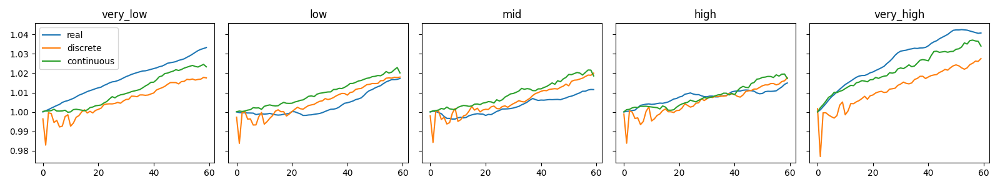
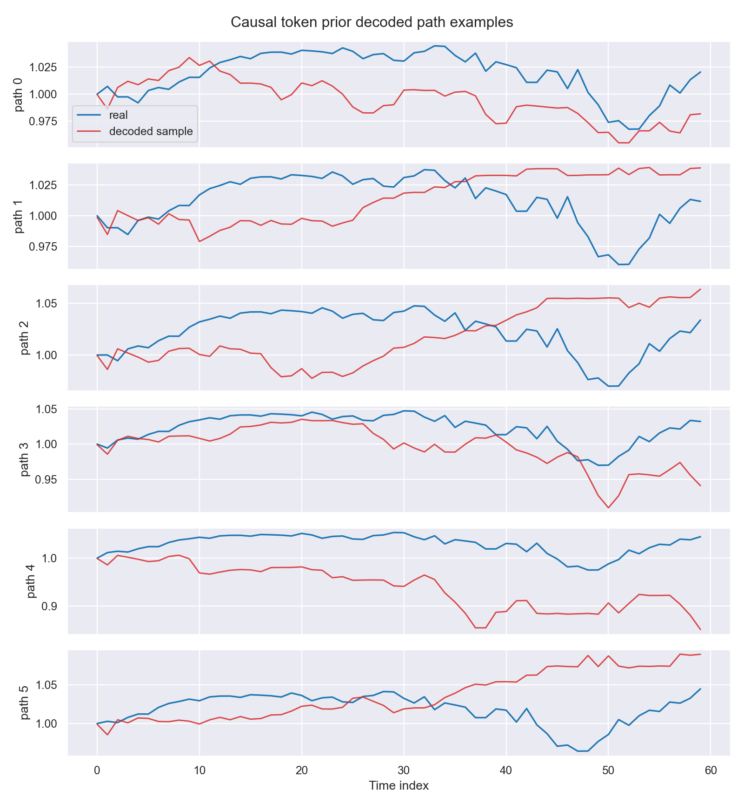
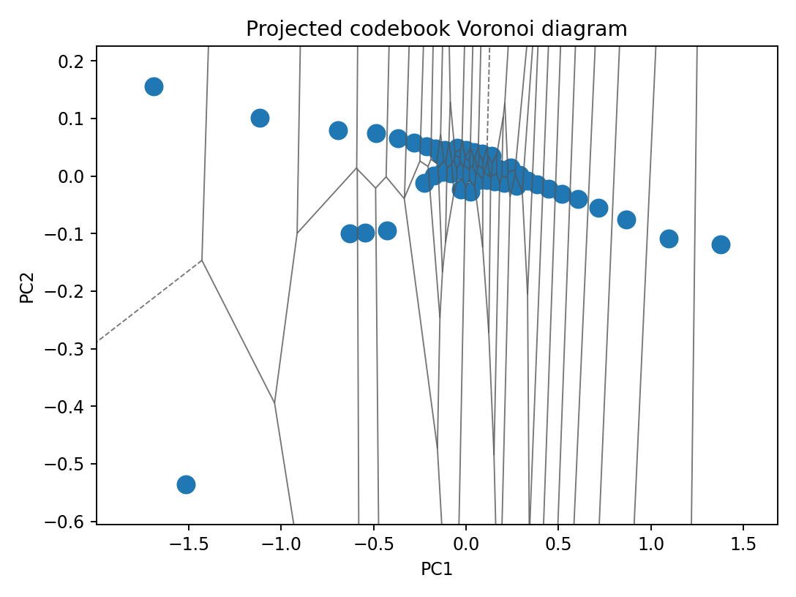
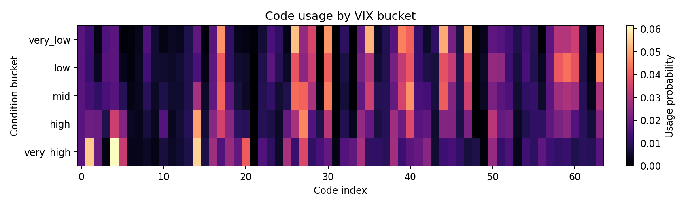

# TimeCausalVAE

`time-causal-vae` is a compact research package, imported as `time_causal_vae`, for
no-anticipation financial time-series generation with continuous and discrete latent models. It
keeps the continuous Time-Causal VAE baseline and adds a public discrete pipeline: a causal VQ
tokenizer followed by a causal autoregressive token prior.

The GitHub repository may remain `TimeCausalVQVAE` because it hosts the VQ-discrete extension of
the TimeCausalVAE package. The Python distribution remains `time-causal-vae`, and the import path
remains `time_causal_vae`. The public branch focuses on S&P500/VIX, with Black-Scholes, Heston,
and path-dependent-volatility configs retained as small baseline and smoke workflows. Generated
outputs, local data, checkpoints, W&B runs, arrays, pickles, and notebooks with outputs are not
committed.

## Pipeline Overview

The package is organised around five steps:

1. **Continuous TC-VAE baseline**: train and evaluate no-anticipation continuous VAE models for
   the benchmark financial datasets.
2. **Causal VQ tokenizer**: encode each time step into discrete latent codes using causal
   convolutional encoders and decoders.
3. **Causal token prior**: model token sequences with a causal autoregressive prior conditioned
   on available scalar context such as VIX.
4. **Financial diagnostics**: compare generated and real paths with distributional,
   autocorrelation, volatility, tail, drawdown, and VIX-bucket diagnostics.
5. **Discrete latent geometry**: inspect codebook usage, codebook projections, VIX-bucket usage,
   and example token trajectories.

## 📦 Installation

The project uses [Poetry](https://python-poetry.org/). For the full development environment:

```bash
poetry install
```

For a lean runtime install:

```bash
poetry install --only main
```

Dependency groups are defined for development, notebooks, and tracking:

- `dev`: Ruff, mypy, pre-commit, Commitizen, nbstripout, and IPython kernel support.
- `notebooks`: Jupyter, seaborn, torchview, and graphviz.
- `tracking`: optional W&B logging support.

## 🔩 Usage

Inspect the public configs without importing model code:

```bash
poetry run python scripts/inspect_selected_configs.py
```

Inspect the registered selected-model metadata used by notebooks and scripts:

```bash
poetry run python scripts/select_registered_model.py --experiment sp500_vix --family discrete
poetry run python scripts/select_registered_model.py --experiment sp500_vix --family discrete --metric mmd
```

The registry is `trained_models/model_registry.yaml`. It records selected continuous and discrete
config paths, local checkpoint conventions, selection profiles, visible metrics, and missing
metrics. These entries are the current registry selections for public workflows, not universal
mathematical optima. The registry does not contain weights. Commands that train or evaluate models
create local `outputs/` directories for checkpoints and artefacts.

Run a minimal continuous S&P500/VIX smoke command:

```bash
poetry run tcvae-train \
  --config configs/experiments/sp500_vix_beta_cvae.yaml \
  --output-dir outputs/sp500_vix_continuous \
  --epochs 1 \
  --no-wandb \
  --dry-run
```

Remove `--dry-run` only when you intentionally want to train.

The public S&P500/VIX discrete baseline is:

```text
configs/experiments/sp500_vix_causal_vq_tokenizer.yaml
configs/experiments/sp500_vix_causal_token_prior_additive.yaml
```

Train the tokenizer, extract tokens, train the prior, and run diagnostics:

```bash
poetry run tcvae-train-tokenizer \
  --config configs/experiments/sp500_vix_causal_vq_tokenizer.yaml \
  --base-data-dir data/processed \
  --output-dir outputs/sp500_vix_discrete/tokenizer \
  --no-wandb

poetry run python scripts/extract_token_indices.py \
  --config configs/experiments/sp500_vix_causal_vq_tokenizer.yaml \
  --tokenizer-dir <tokenizer-dir> \
  --output-dir outputs/sp500_vix_discrete/token_prior/tokens_codebook64_codebookdim16 \
  --base-data-dir data/processed

poetry run tcvae-train-token-prior \
  --config configs/experiments/sp500_vix_causal_token_prior_additive.yaml \
  --output-dir outputs/sp500_vix_discrete/token_prior/additive \
  --no-wandb

poetry run python scripts/evaluate_sp500_vix_paper_style.py \
  --discrete-config configs/experiments/sp500_vix_causal_token_prior_additive.yaml \
  --discrete-prior-dir <prior-dir> \
  --discrete-tokenizer-dir <tokenizer-dir> \
  --continuous-config configs/experiments/sp500_vix_beta_cvae.yaml \
  --continuous-model-dir <continuous-final-model-dir> \
  --output-dir outputs/sp500_vix_discrete/paper_style \
  --base-data-dir data/processed \
  --n-sample 1000 \
  --temperature 0.8 \
  --top-k 40
```

The S&P500/VIX data file is expected at:

```text
data/processed/sp500vix/sp500vix_normalized.npy
```

This file is local and is not committed. Training and evaluation commands create local `outputs/`
directories.

The current best discrete research model pairs a hidden128 VQ tokenizer with a causal
conv-transformer k3 prior. It is documented for comparison on research branches only. It is not
the public default, and its configs, checkpoints, and evidence outputs are not part of this public branch.

## 🧠 Model Architecture

All modelling paths preserve **no anticipation**: at time `t`, encoders, tokenizers, priors, and
diagnostics should only use observations and conditions available up to that point. The causal
convolution checks and token-prior checks in `scripts/` are small public guards for this contract.

The public discrete baseline uses:

- a standard VQ tokenizer with one code per time step;
- causal convolutional encoder and decoder stacks;
- a scalar-conditioned causal autoregressive token prior;
- additive conditioning for the S&P500/VIX public prior.

The hidden128 causal conv-transformer k3 prior is a stronger research variant, not the default
quickstart path. Its closest architectural reference is TCCT, which combines causal convolutional
locality with Transformer modelling for time-series forecasting. This project uses the idea only
as context for an autoregressive discrete-token prior, not as a forecasting model. RVQ q2 was
evaluated on research branches and is not part of the public baseline. Diffusion and
transition-constrained sampling were also evaluated during development, but they remain deferred.

## 🧱 Package Components

- `time_causal_vae.data`: synthetic and market dataset loaders, transforms, and data-pipeline
  helpers.
- `time_causal_vae.models.continuous`: continuous TC-VAE encoders, decoders, conditioners,
  objectives, priors, factory helpers, losses, transforms, and distance helpers.
- `time_causal_vae.models.discrete`: causal VQ tokenizer encoders and decoders, VQ-family
  quantizer adapters, token-prior configs, masks, autoregressive priors, and sampling utilities.
- `time_causal_vae.models.layers`: shared causal layers used across model families.
- `time_causal_vae.evaluation`: financial diagnostics, plotting, model selection, checkpoint
  compatibility, token diagnostics, and latent-geometry helpers.
- `time_causal_vae.experiments`: portable experiment config loading, continuous-config
  adaptation, selection profiles, and trained-model registry selection.
- `notebooks`: continuous, discrete, and report-facing demonstration notebooks.
- `scripts`: config inspection, reproduction wrappers, token extraction, evaluation, latent geometry, and no-leakage checks.

### Upstream TC-VAE Components

This project refactors and preserves selected parts of the original Time-Causal VAE implementation
for public reproducibility. In particular, it keeps the continuous TC-VAE baseline structure and
selected configs, the dataset conventions for Black-Scholes, Heston, PDV, and S&P500/VIX, and a
subset of the financial diagnostics used for generated-vs-real path comparison.

Some optional or external evaluation helpers are retained under
`src/time_causal_vae/evaluation/external/` and `src/time_causal_vae/evaluation/finance/`. These
helpers are included for compatibility and comparison; they should not be read as entirely new
work in this repository.

## 📓 Demos

Notebook demos are grouped by role:

- `notebooks/continuous/`: continuous TC-VAE demos for Black-Scholes, Heston, PDV, and S&P500/VIX.
- `notebooks/discrete/`: public discrete tokenizer and token-prior demos, including latent
  geometry.
- `notebooks/report/`: figure-manifest notebooks that read from local `outputs/` paths.

Committed notebooks should stay output-stripped. The notebooks print guarded commands by default
and should not train or evaluate unless their run flags are deliberately enabled.

## 📊 Summary Figures

Small public demo figures are committed under `assets/figures/`. They are curated from local
TimeCausalVQVAE runs and are not copied from the original TC-VAE repository.









Trained-model metadata is documented in `trained_models/model_registry.yaml` and summarised by
the model cards under `trained_models/<experiment>/model_card.md`. Notebooks can use the registry
to auto-select the registered metadata instead of hard-coding an optimal checkpoint or config.
Weights remain local or external and are not committed.

## 📚 References

- **Time-Causal VAE: Robust Financial Time Series Generator** - Beatrice Acciaio, Stephan
  Eckstein, and Songyan Hou. arXiv DOI:
  [10.48550/arXiv.2411.02947](https://doi.org/10.48550/arXiv.2411.02947); code:
  [justinhou95/TimeCausalVAE](https://github.com/justinhou95/TimeCausalVAE). Adapted part:
  no-anticipation TC-VAE baseline, selected financial diagnostics, conditional PDV and
  S&P500/VIX setup.
- **Neural Discrete Representation Learning** - Aaron van den Oord, Oriol Vinyals, and Koray
  Kavukcuoglu. arXiv DOI:
  [10.48550/arXiv.1711.00937](https://doi.org/10.48550/arXiv.1711.00937). Adapted part:
  VQ-VAE-style discrete latent codes, commitment loss, and tokenizer-prior separation.
- **Vector Quantized Time Series Generation with a Bidirectional Prior Model** - Daesoo Lee,
  Sara Malacarne, and Erlend Aune. PMLR 206; arXiv DOI:
  [10.48550/arXiv.2303.04743](https://doi.org/10.48550/arXiv.2303.04743); code:
  [ML4ITS/TimeVQVAE](https://github.com/ML4ITS/TimeVQVAE). Adapted part: two-stage VQ
  time-series generation reference. The prior in this package remains causal.
- **vector-quantize-pytorch** - lucidrains. Repository:
  [lucidrains/vector-quantize-pytorch](https://github.com/lucidrains/vector-quantize-pytorch).
  Adapted part: VQ-family backend implementations wrapped behind local tokenizer adapters.
- **Residual Quantization with Implicit Neural Codebooks** - arXiv DOI:
  [10.48550/arXiv.2401.14732](https://doi.org/10.48550/arXiv.2401.14732). Adapted part:
  residual-quantization background only.
- **MGVQ: Could VQ-VAE Beat VAE? A Generalizable Tokenizer with Multi-group Quantization** -
  arXiv DOI: [10.48550/arXiv.2507.07997](https://doi.org/10.48550/arXiv.2507.07997).
  Adapted part: future grouped-tokenizer motivation only.
- **DeepVol: Volatility Forecasting from High-Frequency Data with Dilated Causal Convolutions** -
  arXiv DOI: [10.48550/arXiv.2210.04797](https://doi.org/10.48550/arXiv.2210.04797).
  Adapted part: dilated causal convolution motivation for financial time-series encoders.
- **TCCT: Tightly-Coupled Convolutional Transformer on Time Series Forecasting** - Li Shen and
  Yangzhu Wang. DOI: [10.1016/j.neucom.2022.01.039](https://doi.org/10.1016/j.neucom.2022.01.039).
  Adapted part: architectural context for local causal convolution plus Transformer
  modelling in the hidden128 conv-transformer research prior.
- **Vector Quantized Diffusion Model for Text-to-Image Synthesis** - arXiv DOI:
  [10.48550/arXiv.2111.14822](https://doi.org/10.48550/arXiv.2111.14822). Status: deferred;
  used only as discrete diffusion background.
- **Causal Diffusion Transformers for Generative Modeling** - arXiv DOI:
  [10.48550/arXiv.2412.12095](https://doi.org/10.48550/arXiv.2412.12095). Status: deferred;
  used only as causal diffusion background.
- **aotnumerics** - Stephan Eckstein. Repository:
  [stephaneckstein/aotnumerics](https://github.com/stephaneckstein/aotnumerics). Adapted part:
  adapted/causal optimal transport background; no vendored implementation is used in the public
  baseline.
- **Chronos: Learning the Language of Time Series** - arXiv DOI:
  [10.48550/arXiv.2403.07815](https://doi.org/10.48550/arXiv.2403.07815), code:
  [amazon-science/chronos-forecasting](https://github.com/amazon-science/chronos-forecasting).
  Adapted part: contrast with forecasting foundation models and scalar-value tokenisation.
- **Sig-Wasserstein-GANs** - Ni et al. (2021). Adapted part: optional expected-signature metric
  background inherited from upstream evaluation helpers.
- **Randomised-Signature-TimeSeries-Generation** - repository:
  [niklaswalter/Randomised-Signature-TimeSeries-Generation](https://github.com/niklaswalter/Randomised-Signature-TimeSeries-Generation).
  Adapted part: optional signature-metric and neural-SDE background. These routines are not part
  of the public quickstart path.
